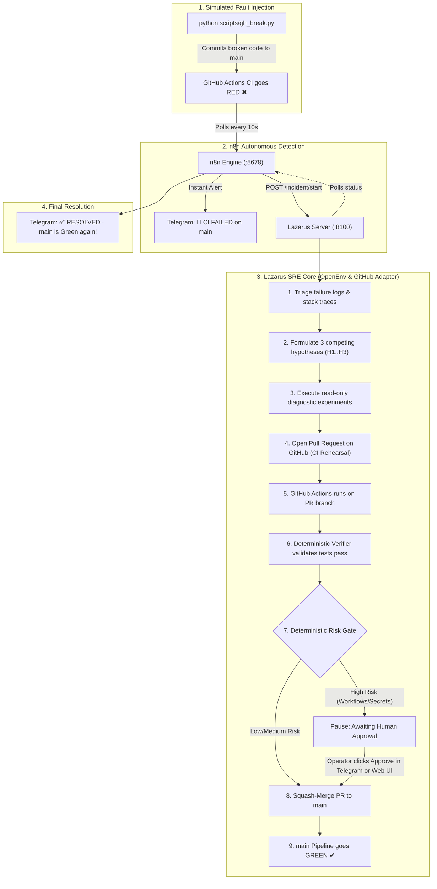

# Lazarus-CI: Real GitHub Self-Healing & Automation Run Guide

> **Target Repository:** [`Vishallakshmikanthan/demo-ci-cd-pooling`](https://github.com/Vishallakshmikanthan/demo-ci-cd-pooling)  
> **Core Principle:** *"The LLM proposes; deterministic code disposes."*  
> **Active Dashboard:** `http://localhost:8100`  
> **n8n Orchestration:** `http://localhost:5678`  
> **Telegram Bot:** `@LazarusAlertsBot` (Chat ID: `7843696928`)

---

## 1. System Architecture & Flow



---

## 2. Quickstart: Launching the Services

### Terminal 1: Launch the Lazarus SRE Server & Mission Control
```powershell
python -m uvicorn lazarus.server:app --port 8100 --reload
```
- Open your browser at **`http://localhost:8100`** to access the Mission Control Dashboard.
- The dashboard displays the real-time GitHub Lifecycle Run Strip, MTTR breakdown bar, Unified Diff viewer, and the Autonomous Timeline.

---

### Terminal 2: Launch n8n Orchestrator (Docker)
Run n8n connected to your host network so it can reach port 8100:
```powershell
docker run -d --name lazarus-n8n -p 5678:5678 -e N8N_SECURE_COOKIE=false --add-host=host.docker.internal:host-gateway -v n8n_data:/home/node/.n8n n8nio/n8n
```

1. Open **`http://localhost:5678`** in your browser.
2. Go to **Workflows** &rarr; click **`...`** (top right) &rarr; **Import from File...**.
3. Select [`n8n/lazarus_github_workflow.json`](n8n/lazarus_github_workflow.json).
4. *(Pre-configured! Zero credentials setup required &mdash; it already includes your repo and direct Telegram integration!)*
5. Toggle the workflow to **Active**.

---

## 3. Running Live Simulations (End-to-End)

You can trigger any of the 5 realistic CI/CD faults using the CLI fault injector. Watch the entire healing cycle happen live on GitHub and Telegram!

---

### Simulation A: Low-Risk Auto-Heal (`deps`)
**What breaks:** An invalid package pin (`requests==99.0.0`) is committed to `requirements.txt`.
```powershell
python scripts/gh_break.py deps
```
**What happens automatically:**
1. Commit lands on `main` &rarr; GitHub Actions run fails with `No matching distribution found for requests==99.0.0`.
2. n8n detects the failure within 10s &rarr; sends a Telegram alert: `🔴 CI FAILED on main`.
3. Lazarus initiates Incident &rarr; tests 3 hypotheses &rarr; confirms invalid pin &rarr; creates branch and opens PR `#...`.
4. PR runs GitHub Actions (CI Rehearsal) &rarr; **Passes**.
5. Risk Gate evaluates **LOW RISK** &rarr; automatically squash-merges PR into `main`.
6. Pipeline on `main` turns **GREEN ✔**.
7. Telegram receives: `✅ RESOLVED: PR merged · main is green again`.

---

### Simulation B: Application Logic Regression (`regression`)
**What breaks:** An off-by-ten mathematical bug (`pct / 10` instead of `pct / 100`) is injected into `app/pricing.py`.
```powershell
python scripts/gh_break.py regression
```
**What happens automatically:**
1. `pytest` fails with `assert 198.0 == 180.0`.
2. Lazarus diagnoses the traceback, corrects the percentage calculation to `100`, and opens a PR.
3. Rehearsal tests pass on the PR &rarr; auto-merged &rarr; `main` turns **GREEN ✔**.

---

### Simulation C: Dockerfile Typo (`dockerfile`)
**What breaks:** A typo `COPY requirments.txt .` inside `Dockerfile` breaks the container build step.
```powershell
python scripts/gh_break.py dockerfile
```
**What happens automatically:**
1. Docker build fails with file not found.
2. Lazarus diagnoses the typo, fixes the spelling in a PR, passes rehearsal, and merges.

---

### Simulation D: High-Risk Human Approval Gate (`pyversion`)
**What breaks:** `.github/workflows/ci.yml` is downgraded to unsupported Python `3.6`.
```powershell
python scripts/gh_break.py pyversion
```
**What happens (Human-In-The-Loop):**
1. Pipeline fails on Python 3.6 setup.
2. Lazarus diagnoses the issue and opens a PR upgrading back to `3.12`.
3. PR rehearsal passes.
4. **Deterministic Risk Gate triggers:** Changes to `.github/workflows` are flagged as **HIGH RISK**.
5. The incident pauses in status `awaiting_approval`.
6. You receive interactive buttons on Telegram (`[✅ Approve & merge]` / `[⛔ Reject]`) and an Approval Card on the web dashboard (`http://localhost:8100`).
7. Tap **Approve** &rarr; Lazarus proceeds to merge the PR &rarr; `main` turns **GREEN ✔**.

---

### Simulation E: Safe Escalation Handoff (`secret`)
**What breaks:** A new test is added requiring a production secret (`PAYMENT_API_KEY`) that is not configured in repository secrets.
```powershell
python scripts/gh_break.py secret
```
**What happens (Safe Escalation):**
1. Test fails because `PAYMENT_API_KEY` is missing.
2. Lazarus recognizes that resolving this requires creating a sensitive credential.
3. **Anti-tampering rule:** The agent refuses to weaken or delete the test, and refuses to forge credentials.
4. Lazarus marks status as `escalated` and generates an **SRE Handoff Report**.
5. Telegram receives: `🆘 ESCALATED: Requires human action: Configure PAYMENT_API_KEY in repository Secrets`.

---

## 4. Resetting the Demo Repository Anytime

To wipe all active faults, close stale PRs, and restore the repository to the pristine green baseline:
```powershell
python scripts/gh_break.py --reset
```

---

## 5. Live Monitoring Surfaces

| Surface | URL / Command | What It Shows |
|:---|:---|:---|
| **Mission Control Dashboard** | `http://localhost:8100` | Real-time Lifecycle Run Strip, MTTR breakdown, Unified Diff viewer, and Timeline. |
| **GitHub Actions Tab** | `https://github.com/Vishallakshmikanthan/demo-ci-cd-pooling/actions` | Live builds, tests, and PR rehearsals. |
| **GitHub Pull Requests** | `https://github.com/Vishallakshmikanthan/demo-ci-cd-pooling/pulls` | Automated PRs opened by Lazarus with full hypothesis logs and risk analysis. |
| **n8n Automation Engine** | `http://localhost:5678` | Live node execution flow, 10s scheduler, and incident polling. |
| **Telegram Bot** | `@LazarusAlertsBot` | Instant failure alerts, resolution messages, and interactive approval buttons. |
| **Metrics & Insights API** | `http://localhost:8100/api/insights` | Measured MTTR (in seconds), autonomy breakdown, and fleet statistics. |
