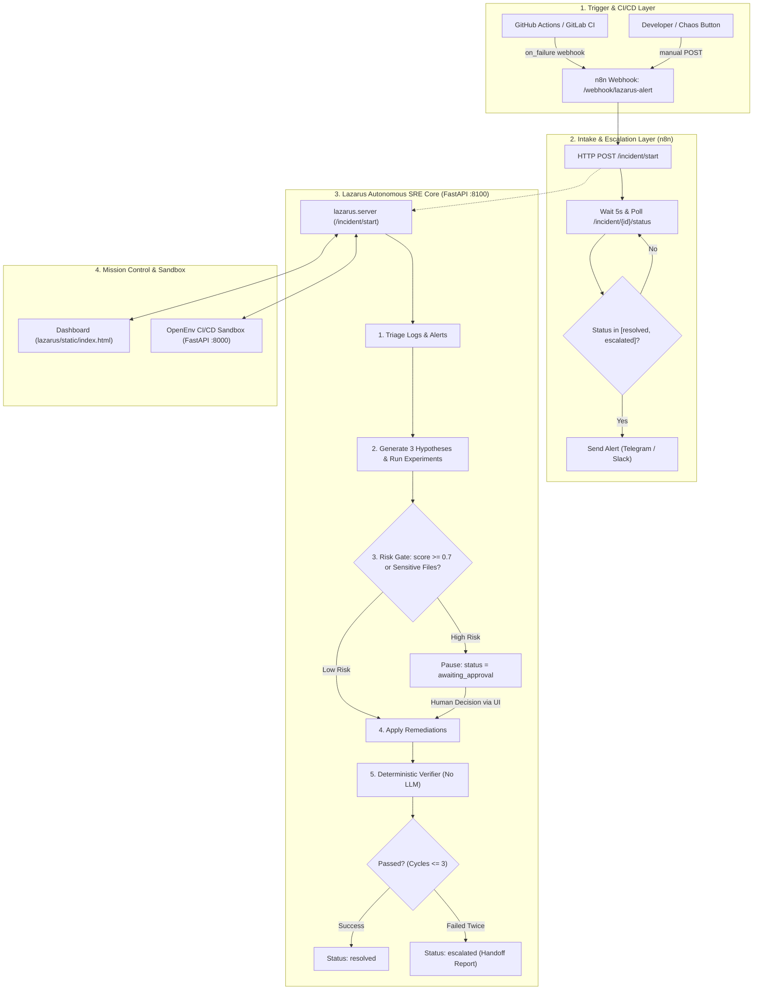

# Lazarus-CI Agentic Automation & n8n Integration Guide

> **Document Version:** 1.0  
> **Target Audience:** DevOps, SRE, and Platform Engineers integrating Lazarus-CI  
> **Core Principle:** *"The LLM proposes; deterministic code disposes."* Risk gating, verification, and human approvals are code-enforced, never left to LLM discretion.

---

## 1. System Architecture Overview

Lazarus-CI splits the automation workload into distinct, specialized layers to maximize stability and reproducibility:



### Separation of Responsibilities

| Layer | Technology | Primary Function |
|---|---|---|
| **Intake & Notification Orchestration** | **n8n** | Ingests CI alerts, starts incident tickets, polls execution status, and notifies on-call teams (Telegram/Slack). |
| **Autonomous Reasoning & Remediation** | **Python / FastAPI (`lazarus/`)** | Performs hypothesis generation, log triage, deterministic risk calculations, and sandbox interactions. |
| **Mission Control Dashboard** | **Vanilla HTML / JS (`lazarus/static/`)** | Live stage visualization, timeline logs, and Human-in-the-loop (HITL) approval actions. |
| **Sandbox & Fault Injection** | **OpenEnv (`server/`)** | Simulates or executes builds, tests, migrations, and docker deployments with real or synthetic faults. |

---

## 2. Setting Up n8n Integration

The `n8n/` folder contains the ready-to-run orchestration pipeline:
- `n8n/README.md`: Quickstart instructions.
- `n8n/lazarus_workflow.json`: Pre-configured n8n workflow definition.

### Step 2.1: Run n8n in Docker

Run n8n with access to your host network so it can communicate with Lazarus on port 8100:

```bash
docker run -d \
  --name lazarus-n8n \
  -p 5678:5678 \
  -e N8N_SECURE_COOKIE=false \
  --add-host=host.docker.internal:host-gateway \
  -v n8n_data:/home/node/.n8n \
  n8nio/n8n
```

> **Note for Windows/macOS:** `--add-host=host.docker.internal:host-gateway` ensures the n8n container can resolve `http://host.docker.internal:8100` to reach the Lazarus API server.

---

### Step 2.2: Import the Lazarus Workflow

1. Open your browser and navigate to **`http://localhost:5678`**.
2. Complete the initial local admin account setup if prompted.
3. In the left navigation bar, go to **Workflows**.
4. Click **Add workflow** (or the **`...`** menu in top right) -> **Import from File...**.
5. Select [`n8n/lazarus_workflow.json`](file:///c:/Users/Lenovo/Downloads/lazarus-ci/n8n/lazarus_workflow.json).
6. The workflow will appear on the canvas with 7 connected nodes:
   - **Node 1: Webhook: Pipeline Alert** (`POST /webhook/lazarus-alert`)
   - **Node 2: HTTP: Start Lazarus Incident** (`POST http://host.docker.internal:8100/incident/start`)
   - **Node 3: Set: Remember Incident ID** (`incident_id = $json.incident_id`)
   - **Node 4: Wait 5s**
   - **Node 5: HTTP: Check Incident Status** (`GET http://host.docker.internal:8100/incident/{id}/status`)
   - **Node 6: IF Resolved or Escalated** (Regex match `^(resolved|escalated)$`)
   - **Node 7: Telegram: Send SRE Alert** (Sends outcome summary to Telegram)

---

### Step 2.3: Configure Telegram Notifications (Optional but Recommended)

1. Open Telegram and search for `@BotFather`.
2. Send `/newbot`, choose a name, and copy the **API Token** provided.
3. Send a message (e.g. `Hello`) directly to your new bot.
4. Open a browser and visit:
   ```
   https://api.telegram.org/bot<YOUR_BOT_TOKEN>/getUpdates
   ```
5. Locate the `"chat":{"id": 123456789}` in the JSON output. This is your `chat_id`.
6. In n8n:
   - Double-click the **Telegram: Send SRE Alert** node.
   - Click **Create New Credential** under **Credential for Telegram API**.
   - Paste your bot token and save.
   - In the **Chat ID** field, enter your numeric chat ID.
7. Click **Save** (top right) and toggle the workflow switch to **Active**.

---

## 3. Connecting CI/CD Pipelines to n8n

### Option A: GitHub Actions Integration

Add the following step to your existing GitHub Actions workflow (e.g. `.github/workflows/pipeline.yml`) to automatically dispatch an alert when a build, test, or deploy stage fails:

```yaml
name: CI Pipeline

on: [push, pull_request]

jobs:
  build-and-test:
    runs-on: ubuntu-latest
    steps:
      - name: Checkout Code
        uses: actions/checkout@v4

      - name: Setup Python
        uses: actions/setup-python@v5
        with:
          python-version: '3.11'

      - name: Run Build & Tests
        id: run_pipeline
        run: |
          pip install -r requirements.txt
          pytest tests/

      # Trigger Lazarus self-healing on failure
      - name: Trigger Lazarus Autonomous Healing
        if: failure()
        run: |
          curl -X POST http://<YOUR_N8N_HOST_OR_IP>:5678/webhook/lazarus-alert \
            -H "Content-Type: application/json" \
            -d '{
              "repository": "${{ github.repository }}",
              "branch": "${{ github.ref_name }}",
              "commit": "${{ github.sha }}",
              "failed_stage": "build_and_test",
              "run_url": "${{ github.server_url }}/${{ github.repository }}/actions/runs/${{ github.run_id }}"
            }'
```

---

### Option B: GitLab CI Integration

In `.gitlab-ci.yml`:

```yaml
after_script:
  - >
    if [ "$CI_JOB_STATUS" == "failed" ]; then
      curl -X POST http://<YOUR_N8N_HOST_OR_IP>:5678/webhook/lazarus-alert \
        -H "Content-Type: application/json" \
        -d "{
          \"repository\": \"$CI_PROJECT_PATH\",
          \"branch\": \"$CI_COMMIT_REF_NAME\",
          \"commit\": \"$CI_COMMIT_SHA\",
          \"failed_stage\": \"$CI_JOB_STAGE\"
        }"
    fi
```

---

### Option C: Manual Trigger via cURL (Fast Verification)

Trigger a live repair cycle manually via the n8n production webhook:

```bash
curl -X POST http://localhost:5678/webhook/lazarus-alert \
  -H "Content-Type: application/json" \
  -d '{"repository": "sample-app", "failed_stage": "build"}'
```

Response from n8n will immediately return:
```json
{"incident_id": 1, "status": "started"}
```

---

## 4. End-to-End Running Instructions

To run the complete system locally, use 3 terminal sessions:

### Terminal 1: OpenEnv Sandbox Server (Port 8000)
Runs the simulated execution sandbox and fault injection engine:
```bash
# Windows PowerShell
$env:CICD_SIMULATE="true"
uv run uvicorn server.app:app --host 0.0.0.0 --port 8000
```

### Terminal 2: Lazarus SRE Server & Mission Control (Port 8100)
Runs the autonomous agent lifecycle, deterministic risk gates, verifier, and web dashboard:
```bash
# Windows PowerShell
uv run uvicorn lazarus.server:app --host 0.0.0.0 --port 8100
```
- Open **`http://localhost:8100`** in your browser to view the real-time Mission Control dashboard.

### Terminal 3: n8n Orchestrator (Port 5678)
```bash
docker start lazarus-n8n
```
- Access **`http://localhost:5678`** to monitor execution flows and logs.

---

## 5. Autonomous Incident Lifecycle (The 7-Step Protocol)

Lazarus operates under a rigorous deterministic framework defined in [`docs/CONTRACTS.md`](file:///c:/Users/Lenovo/Downloads/lazarus-ci/docs/CONTRACTS.md):

```
+-----------------------------------------------------------------------------------+
| 1. ALERT INTAKE        Triggered by n8n or /incident/start                        |
+-----------------------------------------------------------------------------------+
                                       |
+-----------------------------------------------------------------------------------+
| 2. EVIDENCE TRIAGE     Extract logs, error traces, stage failures, configs        |
+-----------------------------------------------------------------------------------+
                                       |
+-----------------------------------------------------------------------------------+
| 3. 3-WAY HYPOTHESIS    Form 3 hypotheses; execute read-only experiments;          |
|                        collect verdict evidence (confirmed/rejected)             |
+-----------------------------------------------------------------------------------+
                                       |
+-----------------------------------------------------------------------------------+
| 4. DETERMINISTIC RISK  Evaluate proposed fix via risk.score():                    |
|                        - Score >= 0.7 OR sensitive files (.env, infra)            |
|                          -> Status: awaiting_approval                             |
|                        - Score < 0.7 -> Auto-approved                             |
+-----------------------------------------------------------------------------------+
                                       |
+-----------------------------------------------------------------------------------+
| 5. HITL APPROVAL       If awaiting_approval, operator decides via Dashboard:      |
|                        POST /incident/{id}/approve {"approved": true/false}       |
+-----------------------------------------------------------------------------------+
                                       |
+-----------------------------------------------------------------------------------+
| 6. APPLY & VERIFY      Execute fix in sandbox; run verifier.verify():             |
|                        Checks build, test, and deploy stages deterministically   |
+-----------------------------------------------------------------------------------+
                                       |
+-----------------------------------------------------------------------------------+
| 7. OUTCOME             - Success: Status -> resolved -> n8n notifies              |
|                        - Cascade: Fix reveals next stage failure -> repeat cycle  |
|                        - Double Failure / Timeout: Status -> escalated (Handoff)  |
+-----------------------------------------------------------------------------------+
```

---

## 6. API Contracts Reference

All communication between n8n, the Lazarus SRE server, and client frontends adheres to the following contract specification:

| Method | Endpoint | Payload / Params | Response | Purpose |
|---|---|---|---|---|
| `POST` | `/incident/start` | `{"fault": "<optional_key>"}` | `{"incident_id": 1, "status": "started"}` | Kicks off autonomous background repair |
| `GET` | `/incident/{id}/status` | Path: `id` | `{"incident_id": 1, "status": "...", "summary": "..."}` | Polled by n8n status loop |
| `GET` | `/incident/{id}/events` | Path: `id` | `{"incident_id": 1, "events": [...]}` | Timeline of all events emitted by agent |
| `POST` | `/incident/{id}/approve`| `{"approved": true}` | `{"ok": true, "decision": true}` | Operator approval verdict |
| `GET` | `/api/state` | None | `{incident, events, bench, now}` | Polled by Mission Control Dashboard |
| `POST` | `/bench/run` | `{"n": 6}` | `{"started": true, "episodes": 6}` | Runs benchmark comparing Lazarus vs Naive |

---

## 7. Troubleshooting & Verification Tips

1. **n8n Cannot Connect to Port 8100**:
   - Ensure the n8n container was started with `--add-host=host.docker.internal:host-gateway`.
   - Verify the URL inside the n8n HTTP Request node is `http://host.docker.internal:8100/incident/start`.
2. **Workflow Shows Error "Webhook not registered"**:
   - In n8n, activate the workflow using the switch in the top right header. Only active workflows respond to the production URL (`/webhook/lazarus-alert`). For testing without activating, use `/webhook-test/lazarus-alert` while clicking **Listen for test event**.
3. **Observing Agent Events in Real Time**:
   - Every agent action, hypothesis verdict, and risk score emits an event via `store.emit(kind, **payload)`:
     ```bash
     curl http://localhost:8100/incident/1/events
     ```
   - These are rendered immediately in the live timeline at `http://localhost:8100`.
