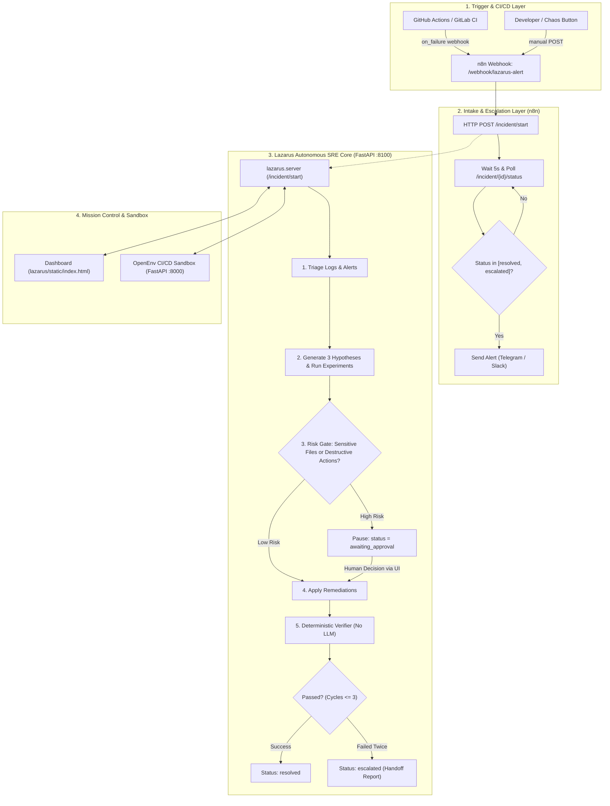

# LAZARUS-CI: Comprehensive Project Guide & Presentation Manual

> **Tagline:** *"Other agents suggest fixes. Lazarus proves them."*  
> **Core Principle:** *"The LLM proposes; deterministic code disposes."* Risk gating, verification, and human approvals are code-enforced, never left to LLM discretion.

---

## 1. Executive Summary & Pitch

### The Problem
Every software team has been there: It is 2 AM, the CI/CD pipeline is red, deployment is blocked, and the on-call engineer is drowning in thousands of lines of noisy logs. Traditional AI chat assistants are ill-suited for this:
- **Blind Guesswork:** They pick the first symptom they notice without systematic triage.
- **Destructive Hallucinations:** They can propose catastrophic actions (`rm -rf`, dropping tables, wiping `.env`, or breaking IAM permissions).
- **Zero Verification:** They claim a problem is "fixed" without ever checking whether the downstream pipeline actually passed.

### The Solution: Lazarus-CI
**Lazarus-CI** is an autonomous, self-healing SRE agent team that investigates, patches, and independently verifies broken CI/CD pipelines.

- **Hypothesis-Driven Diagnosis:** Proposes 3 competing root-cause hypotheses and executes cheap, read-only experiments to confirm or reject them.
- **Deterministic Risk Gate:** Code-enforced policies intercept high-risk operations (secrets, IAM, destructive commands) and pause for **Human-in-the-Loop (HITL)** approval.
- **Zero-LLM Independent Verifier:** An unbiased code verifier compares pipeline state before vs. after. The LLM never grades its own homework.
- **Production-Grade Automation:** Orchestrated end-to-end with **n8n**, **GitHub Actions**, and **Telegram/Slack**.

---

## 2. End-to-End System Architecture



---

## 3. The 6-Step Autonomous Incident Lifecycle

1. **Intake & Triage (`server.py`)**: Ingests failure payloads from webhooks. Digestion extracts failing stages, surfaced errors, recent logs, and config snapshots.
2. **Competing Hypotheses (`agent.py`)**: Proposes exactly 3 competing hypotheses (e.g., dependency mismatch vs. Dockerfile order vs. merge conflict).
3. **Active Experimentation**: Executes read-only sandbox inspection actions (`view_logs`, `inspect_config`, `inspect_dockerfile`) to confirm or refute each hypothesis with evidence.
4. **Deterministic Risk Gate (`risk.py`)**:
   - **Allowed Operations:** Only `modify_config` and `add_dependency`.
   - **Blocked Operations:** Disallowed shell calls or destructive regex patterns (`rm`, `delete`, `drop`, `truncate`, `force-push`).
   - **High Risk:** Changes touching `secret`, `password`, `token`, `api_key`, `iam`, `terraform`, or `.env` automatically trigger a **pause for Human Approval**.
5. **Deterministic Verifier (`verifier.py`)**:
   - Zero LLM reliance.
   - Compares passed stage counts and destructive actions before vs. after the fix.
   - Returns strict verdicts: `passed`, `advanced`, `unchanged`, or `regressed`.
6. **Cascading Handling & Escalation**:
   - Handles multi-stage cascading failures (up to 3 cycles).
   - If a fix fails twice or is blocked, Lazarus generates a comprehensive handoff report and escalates to on-call engineers via n8n.

---

## 4. Agentic Automation Stack & n8n Integration

### Why n8n?
Instead of hardcoding Slack or Telegram bot tokens inside the Python backend, Lazarus uses **n8n** as an enterprise workflow orchestrator. This allows teams to connect Lazarus to Jira, Datadog, PagerDuty, or Discord without changing a single line of Python code.

### The 7-Node n8n Workflow (`n8n/lazarus_workflow.json`):
1. **Webhook Node (`/webhook/lazarus-alert`):** Receives automated alerts from CI/CD pipelines.
2. **HTTP POST Node (`/incident/start`):** Initiates an incident ticket in Lazarus Core (:8100).
3. **Set Node:** Stores `incident_id` in workflow state.
4. **Wait Node:** Waits 5 seconds for agentic triage and execution.
5. **HTTP GET Node (`/incident/{id}/status`):** Polls status from Lazarus Core.
6. **IF Node (`^(resolved|escalated)$`):** Loops until execution reaches terminal state.
7. **Telegram / Slack Node:** Dispatches a structured SRE incident card with root cause, remediation applied, and resolution status.

### CI/CD Pipeline Hooks:
- **GitHub Actions:** Added as an `if: failure()` step in `.github/workflows/pipeline.yml` curling the n8n webhook.
- **GitLab CI:** Added inside `after_script` triggered when `$CI_JOB_STATUS == "failed"`.

---

## 5. Technology Stack

| Layer | Technologies Used | Key Responsibilities |
|---|---|---|
| **AI Models** | **Qwen/Qwen2.5-72B-Instruct** (Primary)<br>Anthropic Claude 3.5 Sonnet<br>OpenAI GPT-4o<br>Groq Llama-3.3-70B | Root-cause hypothesis generation, error comprehension, multi-provider abstraction via [llm.py](file:///c:/Users/Lenovo/Downloads/lazarus-ci/lazarus/llm.py). |
| **Agent Core & Backend** | **Python 3.11+**, **FastAPI**, **Uvicorn**, **HTTPX**, **uv** | Asynchronous incident management, event streaming, REST APIs. |
| **Safety & Verification** | **Deterministic Python Rules** ([risk.py](file:///c:/Users/Lenovo/Downloads/lazarus-ci/lazarus/risk.py), [verifier.py](file:///c:/Users/Lenovo/Downloads/lazarus-ci/lazarus/verifier.py)) | Code-enforced risk screening, regression prevention, zero-LLM verification. |
| **Orchestration** | **n8n (Docker)**, **Webhooks**, **Telegram Bot API** | Event routing, polling state machine, notification automation. |
| **Execution Sandbox** | **OpenEnv Framework**, **Docker**, **Pytest**, **Uvicorn** | Real and simulated CI/CD runtime, fault injector (20+ realistic faults). |
| **Mission Control UI** | **Vanilla HTML5, CSS3, JavaScript** | Real-time DAG pipeline tracking, dark glassmorphism dashboard, HITL approval modal, Chaos panel. |

---

## 6. Reinforcement Learning (RL) & GRPO Simplified

### Why RL?
CI/CD repair is **sequential** (you must read logs before fixing, and fix before verifying), **noisy** (misleading logs and red herrings), and **consequential** (destructive fixes break production). RL trains agents to exhibit discipline rather than random trial-and-error.

### What is GRPO (Group Relative Policy Optimization)?
**GRPO** is the RL algorithm introduced by DeepSeek (DeepSeekMath / DeepSeek-R1) to train reasoning models.

#### The Simple Analogy:
- **Old RL (PPO):** You hire an expensive private tutor (a "Critic" model) who sits beside the student and evaluates every move. This **doubles VRAM requirements**!
- **GRPO:** You ask the model: *"Attempt to fix this exact same incident in 4 different ways."*
  - **Attempt 1:** Guesses blindly $\rightarrow$ Fails (Score: 10)
  - **Attempt 2:** Deletes `.env` $\rightarrow$ Destructive disaster (Score: -50)
  - **Attempt 3:** Reads logs $\rightarrow$ Sets hypothesis $\rightarrow$ Safe fix $\rightarrow$ Verifies green (Score: 95)
  - **Attempt 4:** Edits wrong file $\rightarrow$ Fails (Score: 25)
- **Relative Comparison:** We calculate the average score of the group (about 20). Attempt 3 is way above average, so the model is rewarded! Attempt 2 is penalized.
- **No Critic Model Needed:** Comparing outputs against the group eliminates the Critic model entirely, fitting on standard GPUs with Unsloth.

#### Training Results:
- **Iterations 1–5:** Initial exploration (60%–80% resolution).
- **Iteration 7 Dip (40% resolution):** The UCB1 curriculum unlocked cascading multi-faults and red herrings for the first time.
- **Iterations 9–15:** Policy mastered cascading multi-step reasoning, achieving **100% resolution** and stable convergence.

---

## 7. How to Run the Complete System Locally

Use 3 separate terminals:

### Terminal 1: OpenEnv Sandbox Server (Port 8000)
```powershell
$env:CICD_SIMULATE="true"
uv run uvicorn server.app:app --host 0.0.0.0 --port 8000
```

### Terminal 2: Lazarus SRE Server & Mission Control (Port 8100)
```powershell
uv run uvicorn lazarus.server:app --host 0.0.0.0 --port 8100
```
- Open **`http://localhost:8100`** to view the live Mission Control dashboard.

### Terminal 3: n8n Automation Orchestrator (Port 5678)
```powershell
docker run -d --name lazarus-n8n -p 5678:5678 -e N8N_SECURE_COOKIE=false --add-host=host.docker.internal:host-gateway -v n8n_data:/home/node/.n8n n8nio/n8n
```
- Open **`http://localhost:5678`** and import `n8n/lazarus_workflow.json`.

---

## 8. Pitch & Presentation Cheat-Sheet (2-Minute Script)

> **[Slide 1: Hook]**  
> *"Every engineer has stared at a red CI/CD pipeline at 2 AM. Traditional AI assistants guess blindly, suggest destructive commands, and never verify their results. We built **Lazarus-CI**: an autonomous self-healing SRE platform. Our core philosophy is simple: **The LLM proposes; deterministic code disposes.**"*
>
> **[Slide 2: How It Works]**  
> *"When a pipeline breaks in GitHub Actions, an automated webhook triggers our **n8n orchestrator**, which spins up an incident ticket in Lazarus. Our agent triages the logs, formulates 3 competing hypotheses, and executes non-destructive tests to find the true root cause."*
>
> **[Slide 3: Safety & Human-in-the-Loop]**  
> *"Safety is code-enforced, not an LLM decision. If a proposed fix touches secrets, credentials, or `.env` files, our deterministic risk gate halts the agent and requests human approval on our Mission Control dashboard. Low-risk fixes proceed automatically."*
>
> **[Slide 4: Independent Verification & RL]**  
> *"Once applied, our **zero-LLM verifier** compares the sandbox state before and after. If the pipeline isn't green, it retries cascading fixes or escalates to on-call engineers via Telegram. Behind the scenes, the agent's problem-solving behavior is trained via **GRPO (Group Relative Policy Optimization)**, teaching it real SRE restraint and discipline."*
>
> **[Slide 5: Conclusion]**  
> *"Lazarus-CI turns painful 2 AM pipeline emergencies into verified, safe, and automated recoveries."*
